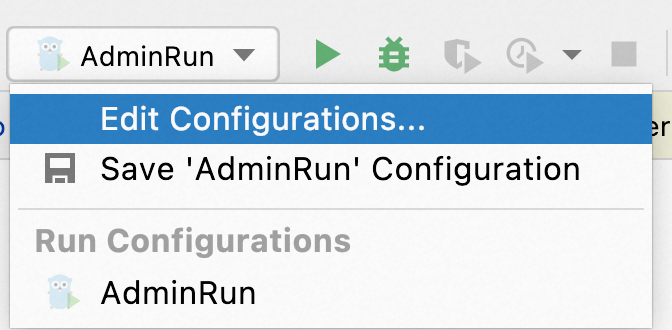

# Developer documentation

The source code guidance of this project. 

With this documentation, developers can learn which part of the project they need to change in order to fix a bug or 
introduce a new feature. How can they verify their codes work as expected before submit a pull request, 
by running the project locally or running the test suite.

## Run Dubbo Admin locally
If you're using GoLand, you can run it locally by following steps:
1. Click `Run configuration` on the top menu bar and add new configuration 
2. Fill the block with the config that screenshot shows below:

3. Modify the config file(app/dubbo-cp/dubbo-cp.yaml), make sure that the registry address, config_center,metadata_report address is valid.
4. Run the application, you can open the browser and visit localhost:8888/admin if everything works.

## Project catalog
We are currently restructuring the entire project, so the directory structure of the project will be changed in the near future.
We will roll out this part of documents once the catalog is stable.

## Pull Request
If you come up with a bug or introduce a new feature, you can follow the steps to make it:
1. Create a new issue and describe your bug/feature in detail.
2. Fork this repository and use git to clone it to local.
3. After local modifications, you can push the commit to your fork repo.
4. Pull a request and associate with the corresponding issue, we will review the pr and merge it.