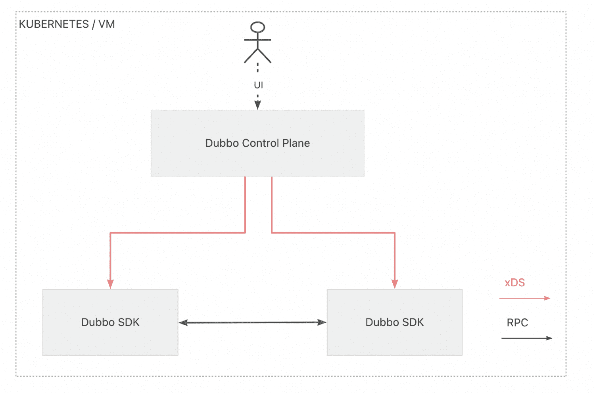
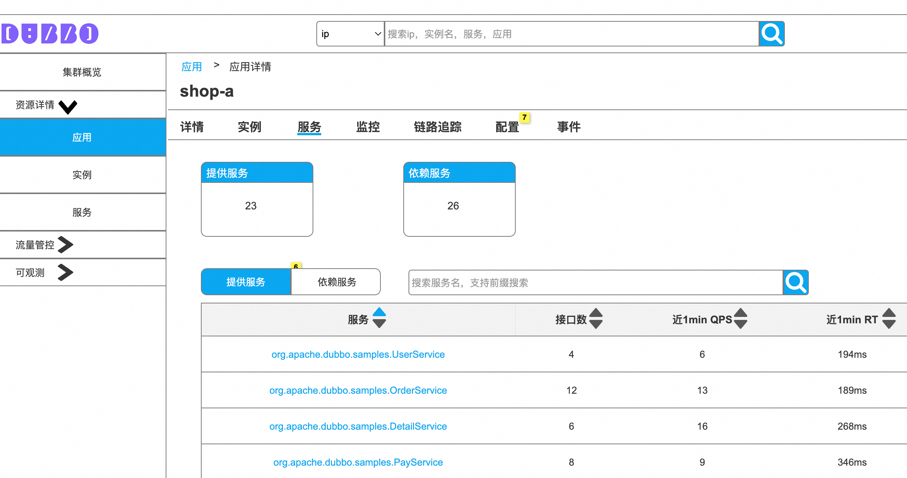
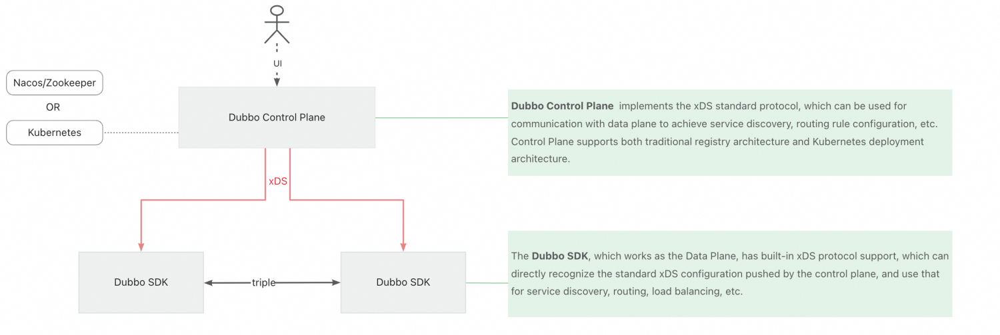
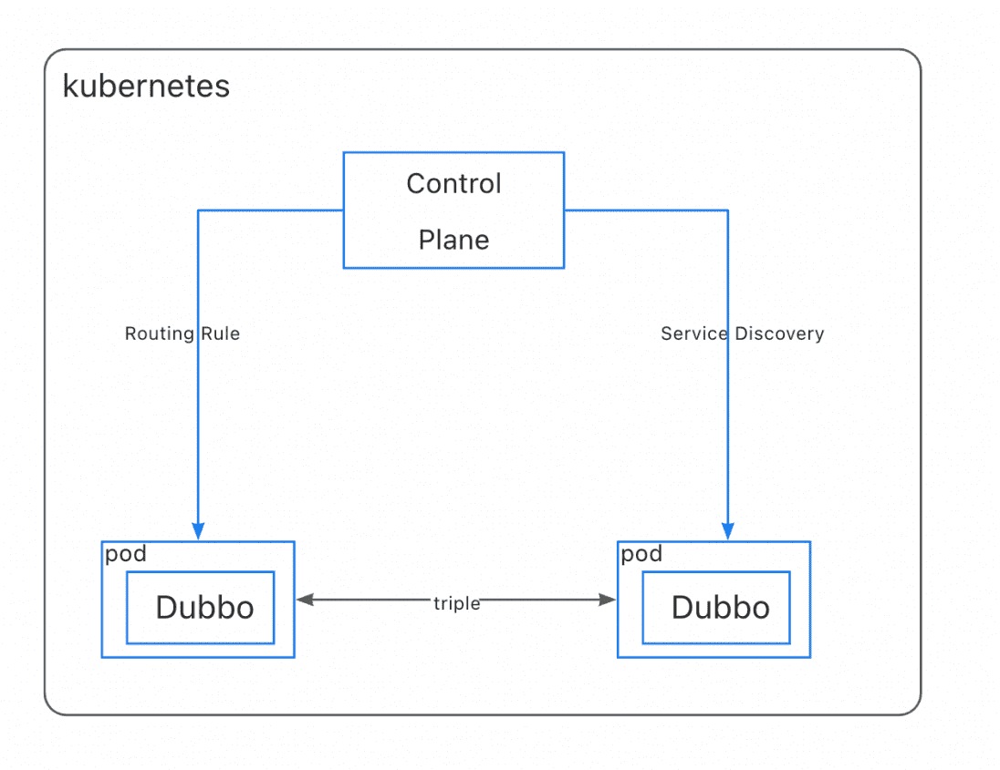
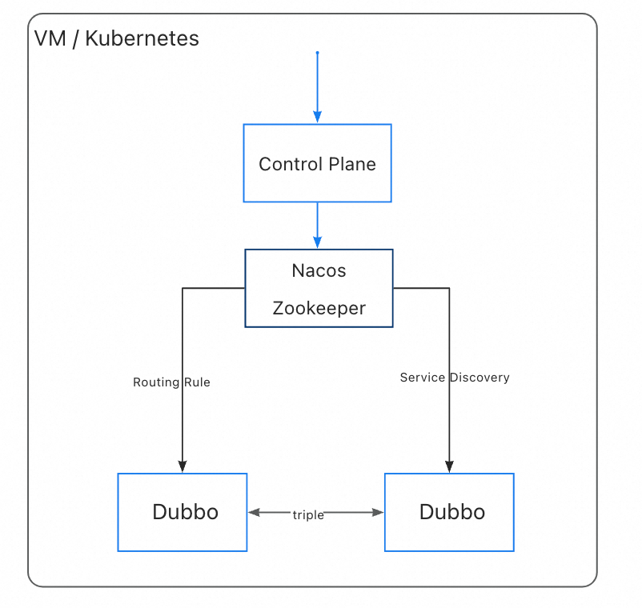
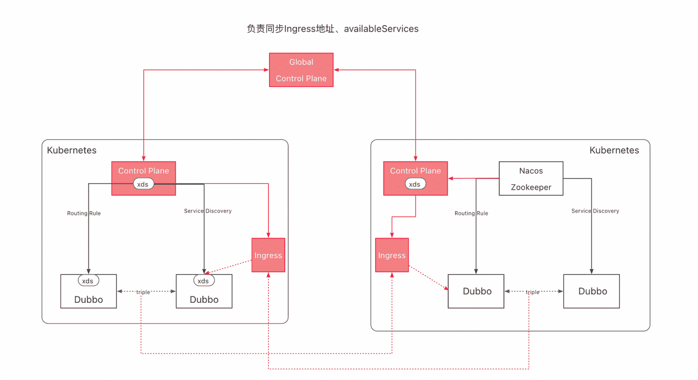

<h1 align="center">
The Dubbo Kubernetes Integration
</h1>

<p align="center" style="color: red; font-weight: bold;">
⚠️ This is still an experimental version. ⚠️
</p>

[](https://github.com/apache/dubbo-kubernetes/actions/workflows/ci.yml)
[](https://codecov.io/gh/apache/dubbo-kubernetes)


**The universal Control Plane and Console for managing microservices on any environment - VM and Kubernetes.**



## Quick Start (under development)
> NOTICE: As the project has not been officially released yet, the following commands may not run properly. The best way for now is to refer to the [Developer's Guide](./DEVELOPER.md) to learn how to download the source code and build it locally!


1. Download `dubbo-control-plane` binary package.
    ```shell
    curl -L https://raw.githubusercontent.com/apache/dubbo-kubernetes/master/release/downloadDubbo.sh | sh -
    
    cd dubbo-$version
    export PATH=$PWD/bin:$PATH
    ```

2. Install `control-plane` on Kubernetes
    ```shell
    dubboctl install --profile=demo
    ```

3. Check installation
    ```shell
    kubectl get services -n dubbo-system
    ```

4. Next, deploy Dubbo applications to Kubernetes as shown below:

    ```yaml
    apiVersion: v1
    kind: Service
    metadata:
      name: demo-service
      namespace: dubbo-demo
    spec:
      selector:
        app: dubbo-demo
      type: ClusterIP
      ports:
        - name: port1
          protocol: http
          port: 80
          targetPort: 8080
    ---
    apiVersion: apps/v1
    kind: Deployment
    metadata:
      name: example-app
      namespace: dubbo-demo
    spec:
      ...
      template:
        metadata:
          ...
          labels:
            app: dubbo-demo
            dubbo.apache.org/service: dubbo-demo
        spec:
          containers:
            ...
    ```
    
    > If you want to create your own Dubbo application from scratch and deploy it, please use [dubboctl]() we provided below.


5. Open the following page to check deployment status on control plane UI:
    ```shell
    kubectl port-forward svc/dubbo-control-plane \
      -n dubbo-system 5681:5681
    ```
    
    visit, 127.0.0.1:5681/admin

   

## Architecture



The microservcice architecture built with Dubbo Control Plane consists of two main components:

- The **`Dubbo Control Plane`** configures the data plane - applications developed with Dubbo SDK, for handling service traffic. Users create [policies]() that the dubbo control plane processes to generate configurations for the data plane.
- The data plane - the **`Dubbo SDK`**, connets directly to control plane and receives configurations that can work as the sources for service discovery, traffic routing, load balancing, etc.

Dubbo Control Plane supports two deployment modes: **`kubernetes`** and **`universal`**.

- **`kubernetes`** mode is like the classic Service Mesh architecture, with all microservices concepts bonded to kubernetes resources. Unlike classic service mesh solutions like istio, Dubbo favors a proxyless data plane deployment - with no envoy sidecar.
- **`universal`** is the traditional microservice architecture that all Dubbo users are already familiar with. Unlike the kubernetes mode, it usually needs a dedicated registry like Nacos or Zookeeper for service discovery, etc.

### Kubernetes
In kubernetes mode, the control plane will interact directly with the Kubernetes API-SERVER, watching the kubernetes resources and transform them as xDS resources for service discovery and traffic management configurations.



We all know the `service` definitions of Kubernetes and Dubo are different, `Kubernetes Service` is more like an application concept run on a selected group of pods while `Dubbo Service` can mean a specific RPC service inside the application process. So how does dubbo control plane manages to bridge the `interface-application` gap, check [here]() for more details.

### Universal
In Universal mode, Dubbo still uses Nacos or Zookeeper as registries for service discovery, control plane then interact with registry directly to work as the console UI,  as the entry point for viewing and managing the cluster.



### Multiple clusters
Dubbo Control Plane supports running your services in multiple zones. It is even possible to run with a mix of Kubernetes and Universal zones. Your microservice environment can include multiple isolated services, and workloads running in different regions, on different clouds, or in different datacenters. A zone can be a Kubernetes cluster, a VPC, or any other deployment you need to include in the same distributed microservice environment. The only condition is that all the data planes running within the zone must be able to connect to the other data planes in this same zone.

Dubbo Control Plane supports a **`global`** deployment mode that can connect different **`zone`** region clusters. The picture below shows how it works.



## Roadmap

- Security
- Metrics
- Cross-cluster communication
- Console

## Refereces

- Dubboctl
- Console UI Design
- Dubbo java xDS implementation
- Dubbo go xDS implementation

## 竞赛文档：面向云原生的下一代微服务集群监测机制，涵盖Kubernetes、Nacos等

1. [设计文档](./docs/面向云原生的下一代微服务集群监测机制，涵盖Kubernetes、Nacos等/设计文档/设计文档：面向云原生的下一代微服务集群监测机制，涵盖Kubernetes、Nacos等+0faa9693-5211-4bcc-aa14-35bba205443c.md)
2. [用户手册](./docs/面向云原生的下一代微服务集群监测机制，涵盖Kubernetes、Nacos等/用户手册/用户手册：面向云原生的下一代微服务集群监测机制，涵盖Kubernetes、Nacos等+2590d6d1-bf4f-49c4-88bb-2f3fdf5671da.md)
