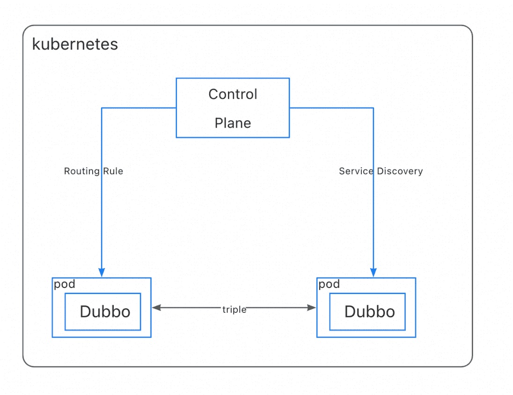
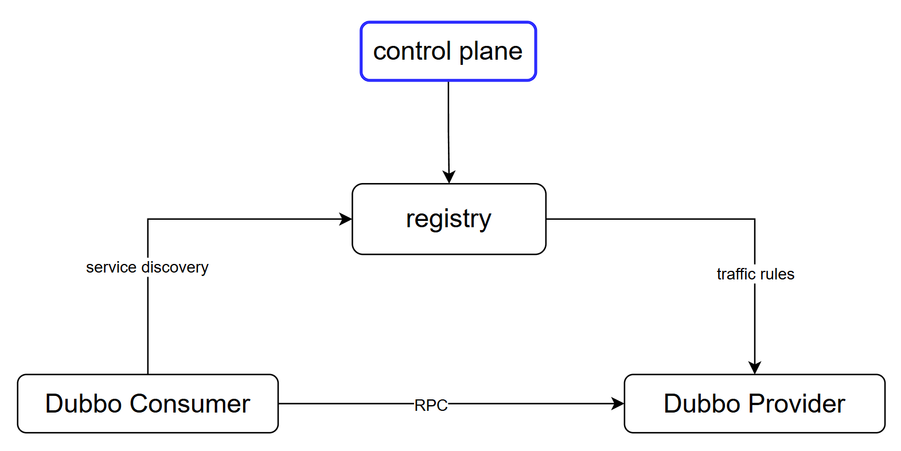

<h1 align="center">
The Dubbo Kubernetes Integration
</h1>

⚠️ This is still an alpha version. ⚠️

## Including Modules
1. Dubboctl: **The operation and deployment tools**
2. Dubbo Admin: **The universal Console and Control Plane(in roadmap) for managing microservices on VM or Kubernetes.**
3. Dubbo Kubernetes Integrations: **The Integrations of cloud native middlewares and dubbo.**

## Quick Start
Please refer to [official website](https://cn.dubbo.apache.org/zh-cn/overview/home/)

## Dubbo Microservice Architecture

The architecture of microservcice based on Dubbo consists of two main components:

- The **`Dubbo Admin`** can configures and monitor the data plane from a global perspective. The Dubbo Admin can be divided into two parts internally: console and control-plane
  - Console: Users can view and manage microservices using Console UI.
  - Control Plane:  The core component that manages different types of resources(traffic rules, service info etc.) behind the scenes.
- The **`Data Plane`** is the Dubbo application built by different language SDKs running in VMs/containers, receiving the resources dispatched by Control Plane(directly or indirectly) and turn them into specific functions, such as service discovery, traffic routing, load balancing, etc.

Dubbo Admin supports three runtime modes: **`kubernetes`**, **`Half`** and **`Universal`**.

### Kubernetes(In development, not supported yet)
In kubernetes mode, the control plane will interact directly with the Kubernetes API-SERVER, watching the kubernetes resources and transform them as xDS resources for service discovery and traffic management configurations.

We all know the `service` definitions of Kubernetes and Dubbo are different, `Kubernetes Service` is more like an application concept run on a selected group of pods while `Dubbo Service` can mean a specific RPC service inside the application process. So how does dubbo control plane manages to bridge the `interface-application` gap, check [here]() for more details.

### Half
In half mode, the dubbo applications are deployed in k8s cluster, while still using Nacos or Zookeeper as registries for service discovery.
In this mode, the control plane can retrieve and merge info from k8s and registries. The traffic policies are dispatched by control plane through registries. 

### Universal
In Universal mode, the dubbo applications are deployed in VM, using Nacos or Zookeeper as registries for service discovery, 
control plane then interact with registry directly.

## Roadmap
1. Kubernetes mode support and sidecarless mesh development.
2. Code robustness.
3. More pathways of microservices observability.  

## Contributing
If you're interested and want to dive into this project, you can follow these docs:
[Developer](./DEVELOPER.md)
[Dubboctl](./docs/dubboctl/concepts.md)

