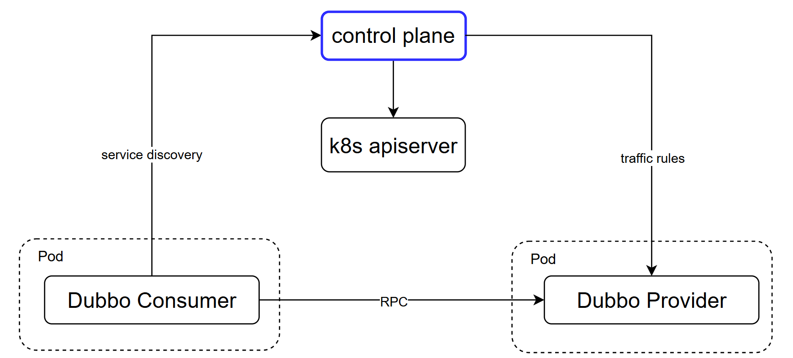
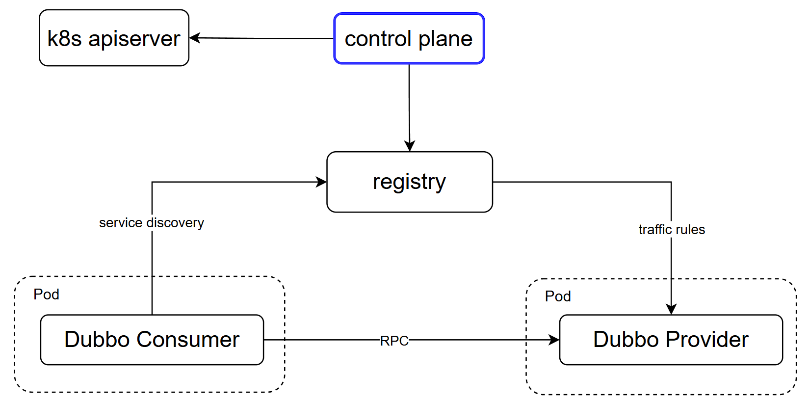
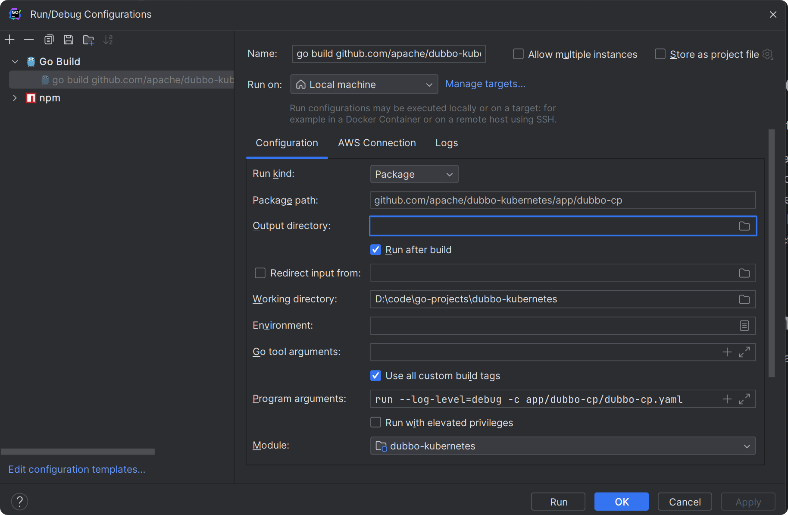

# dubbo-cp

The architecture of microservcice based on Dubbo consists of two main components:

- The **`Dubbo Admin`** can configures and monitor the data plane from a global perspective. The Dubbo Admin can be divided into two parts internally: console and control-plane
    - Console: Users can view and manage microservices using Console UI.
    - Control Plane:  The core component that manages different types of resources(traffic rules, service info etc.) behind the scenes.
- The **`Data Plane`** is the Dubbo application built by different language SDKs running in VMs/containers, receiving the resources dispatched by Control Plane(directly or indirectly) and turn them into specific functions, such as service discovery, traffic routing, load balancing, etc.

Dubbo Admin supports three runtime modes: **`kubernetes`**, **`Half`** and **`Universal`**.

### Kubernetes(In development, not supported yet)
In kubernetes mode, the control plane will interact directly with the Kubernetes API-SERVER, watching the kubernetes resources and transform them as xDS resources for service discovery and traffic management configurations.

We all know the `service` definitions of Kubernetes and Dubbo are different, `Kubernetes Service` is more like an application concept run on a selected group of pods while `Dubbo Service` can mean a specific RPC service inside the application process. So how does dubbo control plane manages to bridge the `interface-application` gap, check [here]() for more details.

### Half
In half mode, the dubbo applications are deployed in k8s cluster, while still using Nacos or Zookeeper as registries for service discovery.
In this mode, the control plane can retrieve and merge info from k8s and registries. The traffic policies are dispatched by control plane through registries.

### Universal
In Universal mode, the dubbo applications are deployed in VM, using Nacos or Zookeeper as registries for service discovery,
control plane then interact with registry directly.

## Developer documentation

The source code guidance of this project. 

With this documentation, developers can learn which part of the project they need to change in order to fix a bug or 
introduce a new feature. How can they verify their codes work as expected before submit a pull request, 
by running the project locally or running the test suite.

### Run Dubbo Admin locally
If you're using GoLand, you can run it locally by following steps:
1. Click `Run configuration` on the top menu bar and add new configuration 
2. Fill the block with the config that screenshot shows below:

3. Modify the config file(app/dubbo-cp/dubbo-cp.yaml), make sure that the registry address, config_center,metadata_report address is valid.
4. Run the application, you can open the browser and visit localhost:8888/admin if everything works.

### Project catalog
We are currently restructuring the entire project, so the directory structure of the project will be changed in the near future.
We will roll out this part of documents once the catalog is stable.

### Pull Request
If you come up with a bug or introduce a new feature, you can follow the steps to make it:
1. Create a new issue and describe your bug/feature in detail.
2. Fork this repository and use git to clone it to local.
3. After local modifications, you can push the commit to your fork repo.
4. Pull a request and associate with the corresponding issue, we will review the pr and merge it.

# dubbo-ui