参赛队伍：见微知著（何太波、钟坚、罗广）

## 介绍

Dubbo作为一款领先的微服务框架，提供了丰富的服务治理功能，受到了广泛的认可和支持。然而，随着时间的推移，我们发现Dubbo Admin已经无法满足日益增长的需求，主要体现在以下几个方面：

1. 随着开源观测组件（如Prometheus、Grafana、OpenTelemetry）的广泛应用，Dubbo Admin无法有效整合这些组件，从而无法为用户提供全面的观测解决方案。

2. 随着容器和Kubernetes的普及，Dubbo Admin无法直接获取到这些环境中的运行时数据，限制了对微服务的实时监控和管理。

3. 用户对流量管控的需求日益增加，然而Dubbo Admin缺乏直观友好的界面来管理流量规则，导致用户的操作复杂度和学习成本增加。

因此，为了满足 Dubbo 用户在微服务可观测领域日益增长的需求，我们计划推出新一代Dubbo服务集群控制台——Dubbo Console，旨在解决以上问题，具体包括：

1. 支持可观测领域的开源标准，通过简单的配置即可与主流观测组件集成，为用户提供更全面的观测手段和更广泛的数据源。

2. 提供统一的服务数据观测视角，适配不同的服务运行环境，无论是传统的虚拟机部署还是现代的Kubernetes容器环境，亦或是融合部署的场景。

3. 优化流量规则的管理流程，提供直观友好的界面，使用户能够轻松地查看、搜索、编辑和下发流量规则，降低操作复杂度和学习成本。

下面是我们的总体架构：可观测数据来源分为通过抽象层获取的来自不同集群数据源 API 信息和利用 Prometheus、Jaeger 提供的监控数据两个部分；其中 Prometheus、Jaeger 的监控数据会整合到 Grafana 中，以网页内容的方式提供给前端；抽象层会对来自于传统集群或者 k8s 集群的信息进行资源抽象协调，对接口开发者提供统一的操作协议。

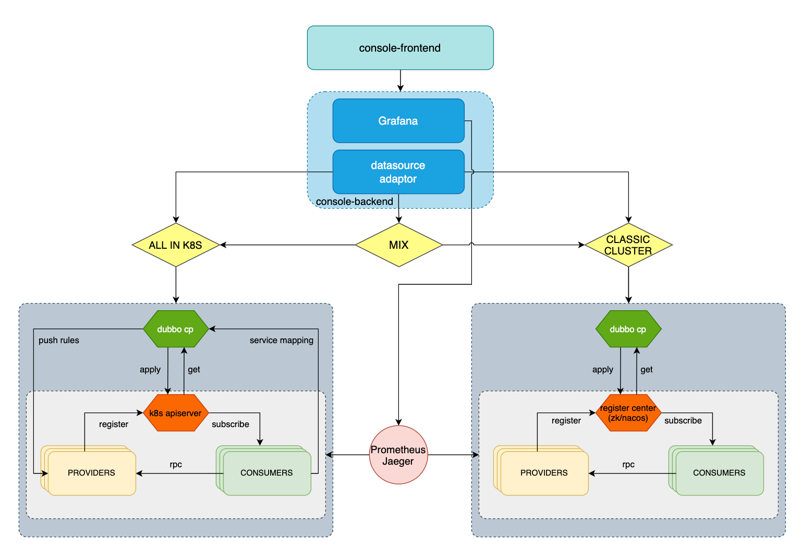

## 快速入门

- 默认您已经具备以下集群环境：

    - CLASSIC CLUSTER：传统虚拟机环境，以 nacos、zookeeper 等为注册中心的 Dubbo 集群

    - ALL IN K8S ：k8s 集群环境

    - MIX: 融合传统集群环境和 k8s 环境

- 安装Dubbo Console Plane

    - CLASSIC CLUSTER:

        ```Shell
        # 本地启动一个zookeeper， 127.0.0.1:2181 即可
        make run/dubbo-cp
        ```

    - ALL IN K8S 

        ```Shell
        kubectl apply -f test/control-plane/crds
        make run/dubbo-cp
        ```

    - MIX

        ```Shell
        #本地启动一个zookeeper， 127.0.0.1:2181 即可
        kubectl apply -f test/control-plane/crds
        make run/dubbo-cp
        ```

- 访问 Dubbo Console 前端

    - [http://localhost:38080/admin](http://localhost:38080/admin)

## 功能介绍与使用说明

### 集群概览

在首页可以看到当前集群环境中比较重要的指标和元数据信息：

1. 部署资源数量

2. 集群详情和注册中心详情


### 资源详情

资源详情中包括我们提供的以应用、实例和服务三个视角出发的微服务可视化信息的能力

#### 应用

1. 提供应用检索能力，展示应用的名称实例数量、部署集群、注册集群等信息。

2. 点击应用名可以进行单个应用的详情查看、应用相关实例信息、应用相关服务信息

3. 除了基础的信息查看，我们还提供了

    4. 基于 grafana 定制的 dubbo 应用大盘监控

    5. 基于 opentelemetry/jaeger/grafana的链路追踪 

    6. 应用层面的场景化配置（未来规划）

    7. 应用事件监测（未来规划）

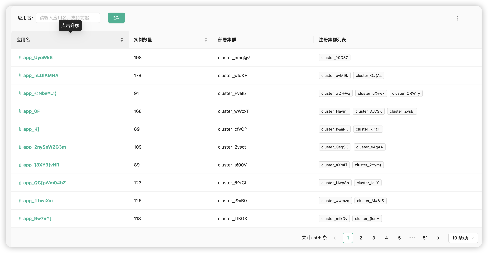

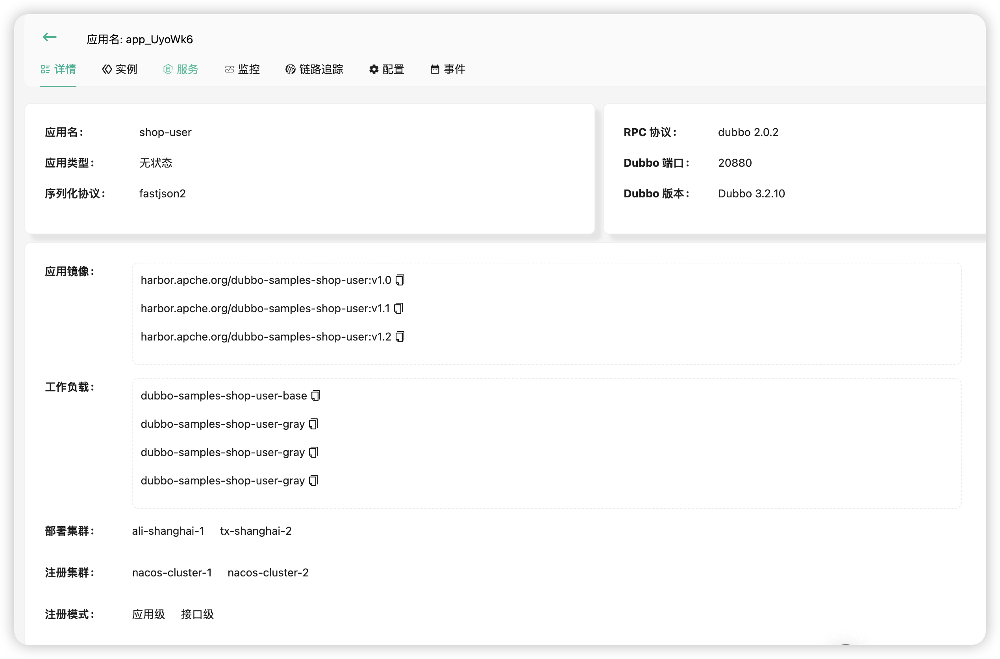

#### 实例

1. 提供实例检索能力，展示实例IP、部署信息、注册信息、资源消耗等信息（From Prometheus）。

2. 点击IP可以进行单个实例的详情查看

3. 除了基础的信息查看，我们还提供了

    4. 基于 grafana 定制的 dubbo 示例大盘监控

    5. 基于 opentelemetry/jaeger/grafana的链路追踪 

    6. 实例层面的场景化配置（未来规划）

    7. 实例事件监测（未来规划）

    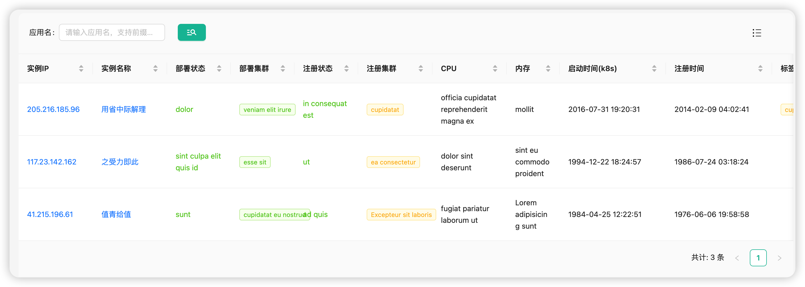

    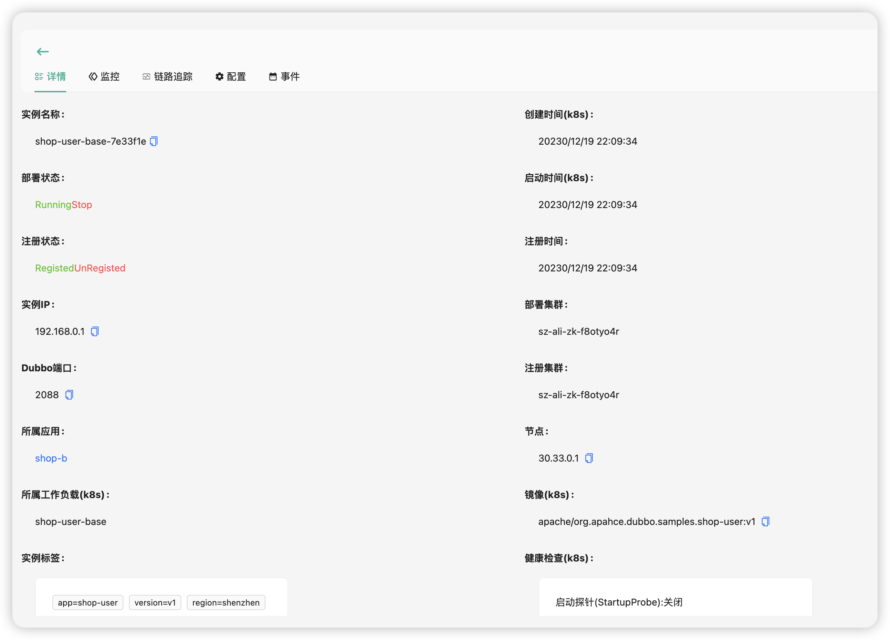

#### 服务

1. 提供服务检索能力，展示服务的名称、接口数量、服务指标等信息（From Prometheus）。

2. 点击服务名可以进行单个应用的详情查看

3. 除了基础的信息查看，我们还提供了

    4. 支持多种协议（Dubbo、Triple、Http 等）的服务接口调试功能

    5. 查看服务的实际分布

    6. 基于 grafana 定制的 dubbo 服务大盘监控

    7. 基于 opentelemetry/jaeger/grafana的链路追踪 

    8. 服务层面的场景化配置（未来规划）

    9. 服务事件监测（未来规划）

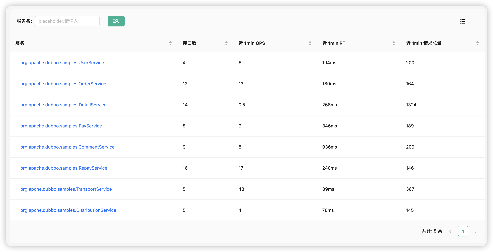

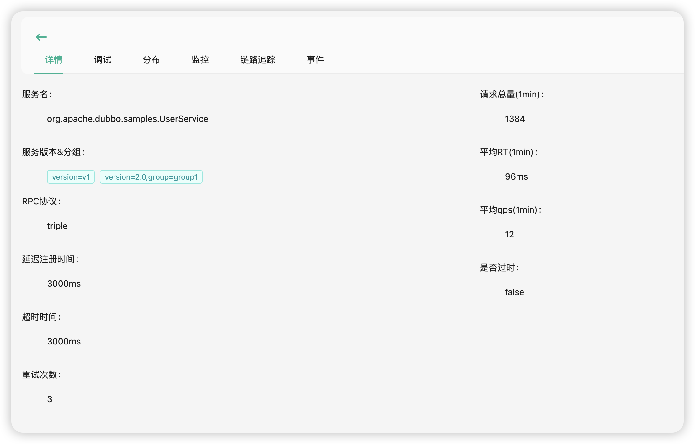

## 流量管控

根据 dubbo 的流量[管控规则](https://cn.dubbo.apache.org/zh-cn/overview/core-features/traffic/)，我们希望在条件路由、标签路由和动态配置方面提供给用户可视化编辑的能力：包括表单化的引导式配置和 yaml 的原生编辑配置能力。

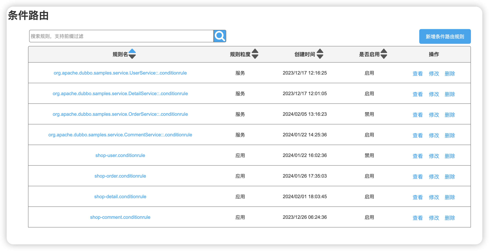

### 条件路由

1. 条件路由规则的检索、新增修改和删除

2. 路由规则的表单可视化编辑

3. 路由规则的表单 yaml 编辑

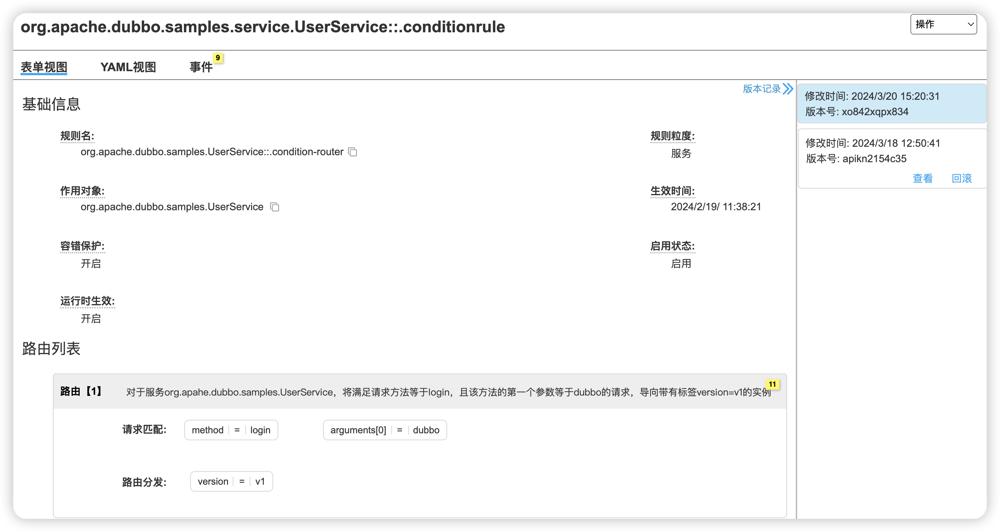

### 标签路由

1. 标签路由规则的检索、新增修改和删除

2. 路由规则的表单可视化编辑

3. 路由规则的表单 yaml 编辑

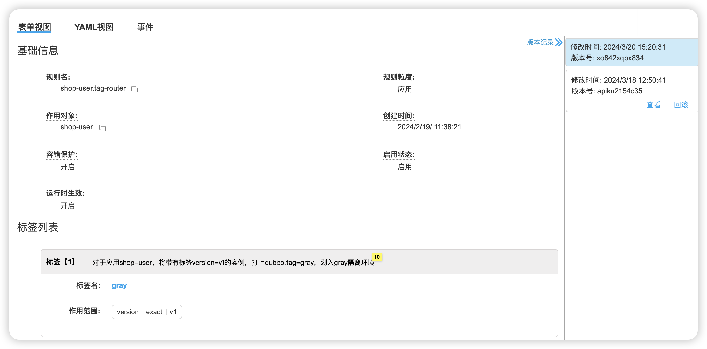

### 动态配置

1. 条件路由规则的检索、新增修改和删除

2. 路由规则的表单可视化编辑

3. 路由规则的表单 yaml 编辑

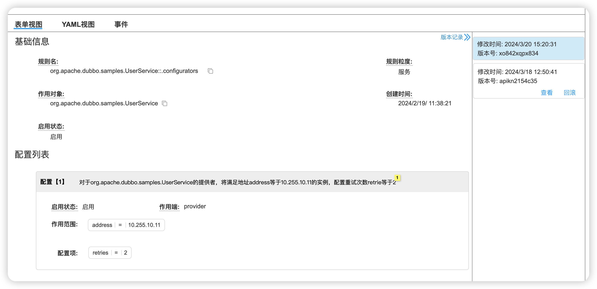

### Mesh路由（未来规划）

