参赛队伍：见微知著（何太波、钟坚、罗广）

## 目标

### 目标

设计和实现一套全新的方案，能够支持Kubernetes集群场景下的可视化监测、流量管控。解决社区与众多企业用户面临的监控Apache Dubbo微服务集群的问题。

### 背景与意义

此前，在 Apache Dubbo 开源社区的积极贡献下，已经奠定了基于传统微服务架构部署的可观测基础，Dubbo3 提供了内置 Mtrics、Tracing 埋点，同时还提供了 Admin 可视化控制台。但随着云原生的架构模式得到越来越多的用户推崇， Apache Dubbo 的用户主要有以下类型：

1. 出于种种现实原因短时间无法将业务部署到云原生架构模式的老用户；

2. 愿意将一部分业务迁移到云原生架构模式，但依然保留足够多业务在传统架构下的老用户；

3. 愿意将所有业务部署到云原生架构模式的新老用户；

上述分析的三类用户实际上要求了 Apache Dubbo 面向云原生的下一代微服务集群监测的机制需要满足：

1. 保留和改善传统微服务架构部署的可观测能力(CLASSIC CLUSTER)；

2. 实现云原生架构下的可观测能力(ALL IN K8S)；

3. 融合传统微服务和云原生架构两种集群模式的可观测能力(MIX)。

## 业务方案

### 需求

- 优先级描述：

    - P1：完成项目目标必须满足的需求

    - P2：提升用户体验的需求

    - P3：不影响用户使用完整度的衍生需求，仅做规划，本次竞赛不完成

1. 集群概览

    |模块|功能点|优先级|
|-|-|-|
|集群详情|集群详情、注册中心详情、k8s详情（可选）|P1|
|数据大盘|资源数量统计、集群性能数据|P2|
|事件列表|集群动态事件、注册中心动态事件、部署、规则相关的动态事件|P3|

1. 资源可视化监测

    我们将资源抽象为应用、实例和服务三个维度，以这三个主体为中心去探讨资源可视化的能力实现。

    |模块|功能点|优先级|
|-|-|-|
|应用监测|应用检索|P1|
|应用监测|应用→详情|P1|
|应用监测|应用→实例检索与相关指标统计|P1|
|应用监测|应用→服务检索与相关指标统计|P1|
|应用监测|应用→监控：基于 grafana 的 dubbo 定制化应用大盘|P2|
|应用监测|应用→ 链路追踪：基于opentelemetry/jaeger/grafana的链路追踪|P2|
|应用监测|应用→场景配置|P3|
|应用监测|应用→事件|P3|
|实例监测|实例检索|P2|
|实例监测|实例→详情|P1|
|实例监测|实例→监控：基于 grafana 的 dubbo 定制化实例大盘|P2|
|实例监测|实例→ 链路追踪：基于opentelemetry/jaeger/grafana的链路追踪| P1|
|实例监测|实例→场景配置|P3|
|实例监测|实例→事件|P3|
|服务监测|服务检索| P1|
|服务监测|服务→详情（生产者、消费者）| P1|
|服务监测|服务→接口调试| P1|
|服务监测|服务→服务分布（生产者、消费者)| P1|
|服务监测|服务→基于 grafana 的 dubbo 定制化服务大盘| P2|
|服务监测|服务→ 链路追踪：基于opentelemetry/jaeger/grafana的链路追踪| P2|
|服务监测|实例→场景配置|P3|
|服务监测|实例→事件|P3|

1. 流量管控

    根据 dubbo 的流量[管控规则](https://cn.dubbo.apache.org/zh-cn/overview/core-features/traffic/)，我们希望在条件路由、标签路由和动态配置方面提供给用户可视化编辑的能力：包括表单化的引导式配置和 yaml 的原生编辑配置能力。

    |模块|功能点|优先级|
|-|-|-|
|条件路由|条件路由检索|P1|
|条件路由|表单化配置|P1|
|条件路由|yaml视图配置|P1|
|条件路由|事件|P3|
|标签路由|标签路由检索|P1|
|标签路由|表单化配置|P1|
|标签路由|yaml视图配置|P1|
|标签路由|事件|P3|
|动态配置|动态配置检索|P1|
|动态配置|表单化配置|P1|
|动态配置|yaml视图配置|P1|
|动态配置|事件|P3|
|服务网格|Visual Service|P3|
|服务网格|DestinationRule|P3|

### 原型

#### 集群概览

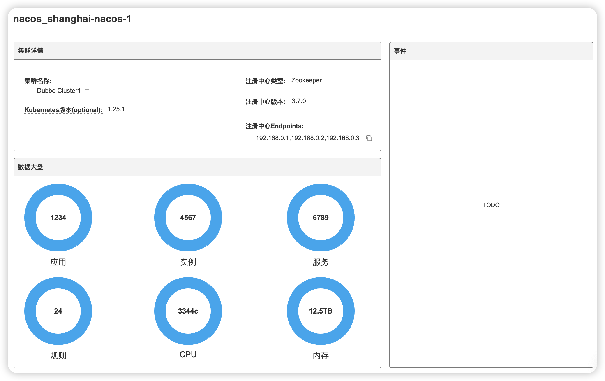

#### 资源监控

1. 应用

    2. 应用列表

        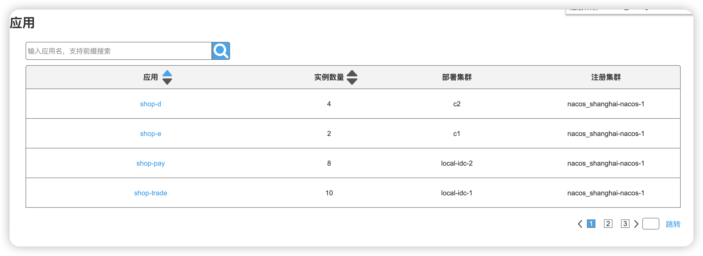

    1. 应用详情

        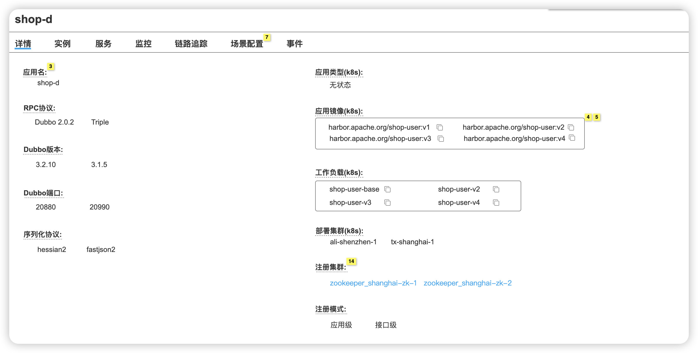

    1. 应用实例

        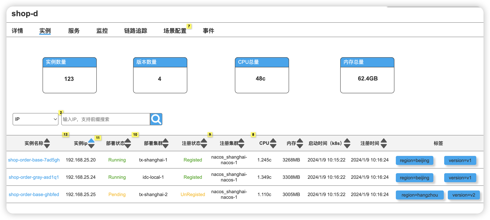

    1. 应用服务

        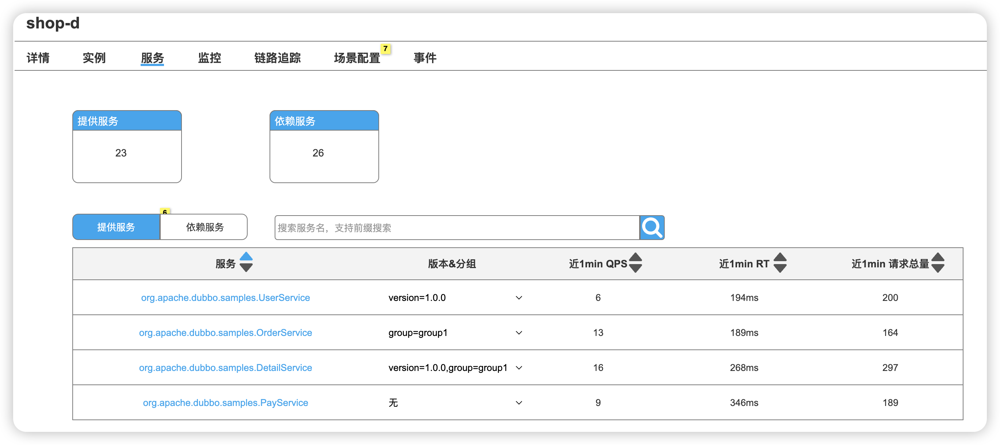

    1. 应用监控

        嵌入 grafana 大盘

    1. 应用链路追踪

        嵌入 grafana 大盘

    1. 场景配置（未来规划）

    2. 事件（未来规划）

3. 实例

    4. 实例检索

        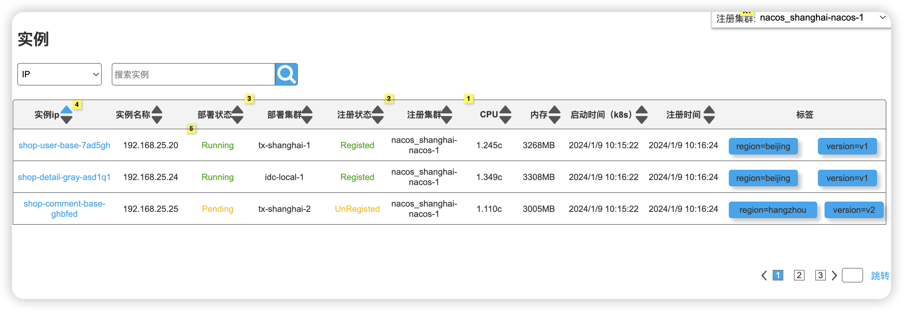

    1. 实例详情

        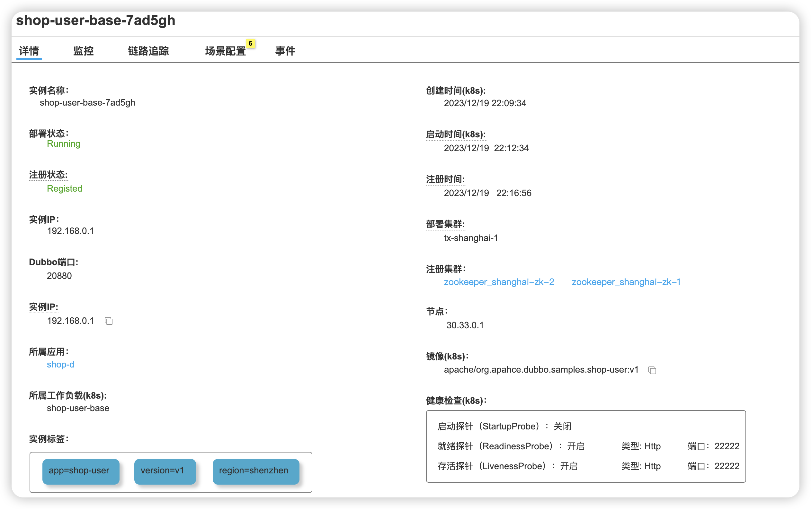

    1. 实例监控

        嵌入 grafana 大盘

    1. 实例链路追踪

        嵌入 grafana 大盘

    1. 场景配置（未来规划）

    2. 事件（未来规划）

3. 服务

    4. 服务检索

        

    1. 服务详情

        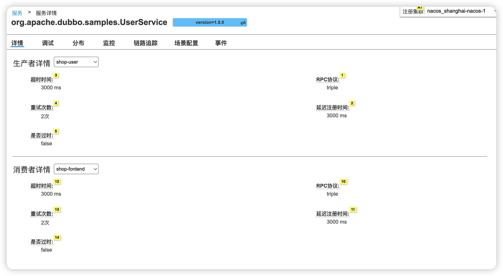

    1. 服务调试

        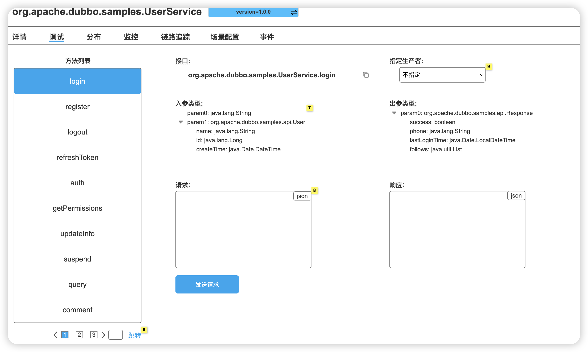

    1. 服务分布

        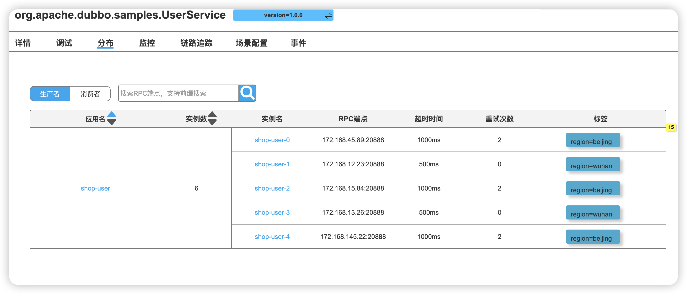

    服务监控

        嵌入 grafana 大盘

    服务链路追踪

        嵌入 grafana 大盘

    场景配置（未来规划）

    事件（未来规划）

#### 流量管控

1. 条件路由

    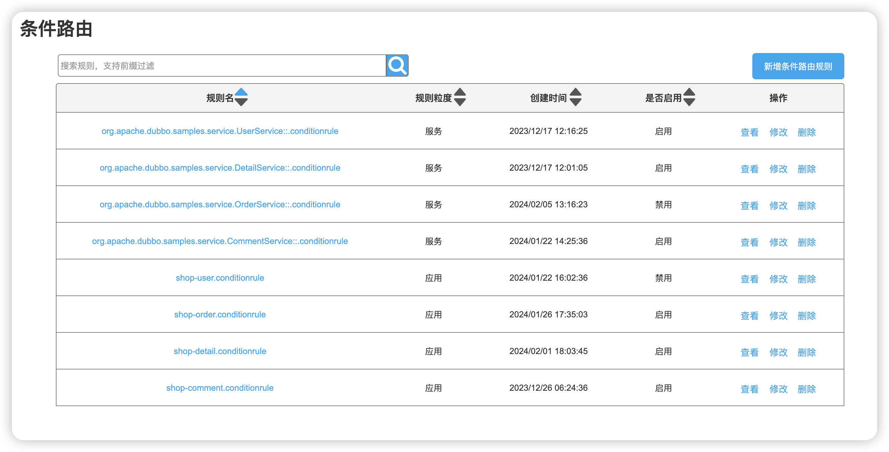

    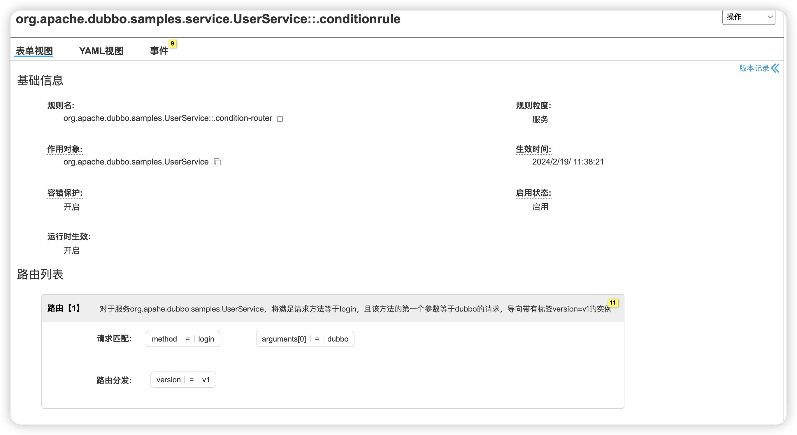

    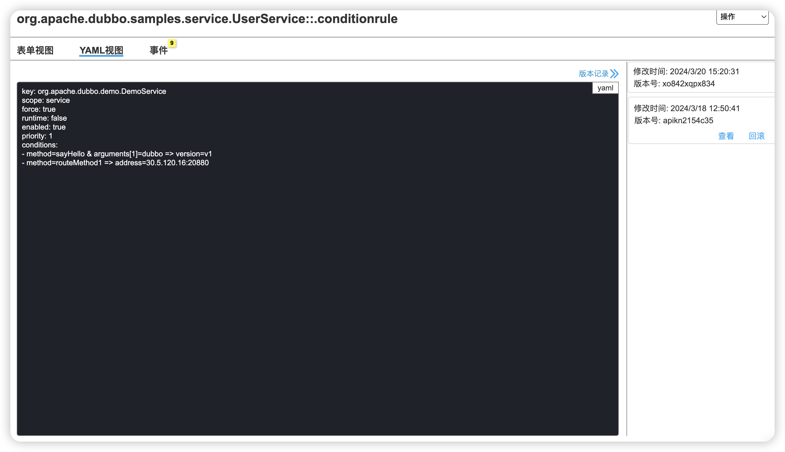

1. 标签路由

    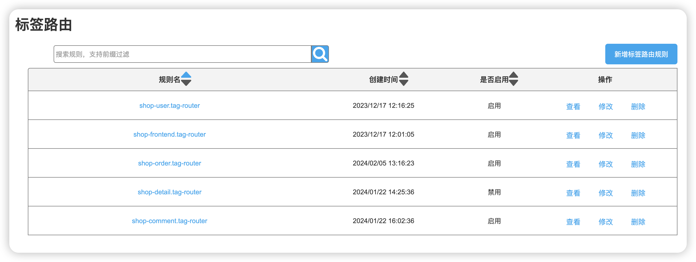

    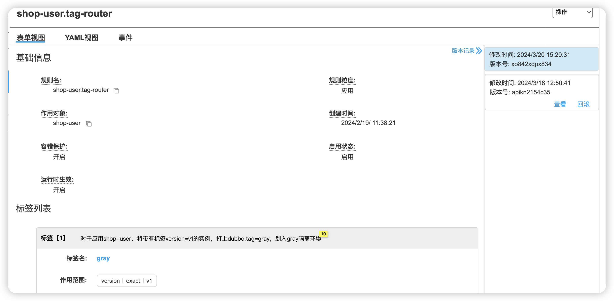

    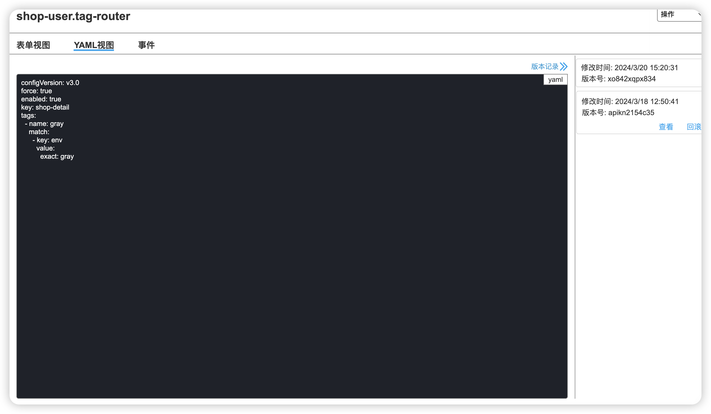

1. 动态配置

    

    

    

1. MeshRule（未来规划）

## 方案设计

### 总体架构设计

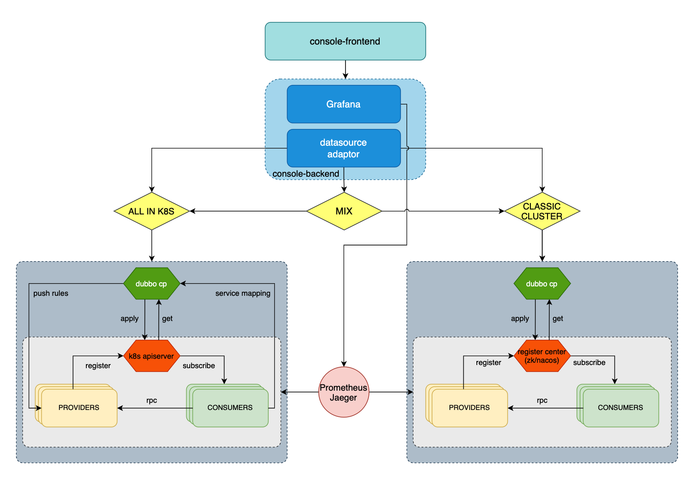

可观测数据来源分为通过抽象层获取的来自不同集群数据源 API 信息和利用 Prometheus、Jaeger 提供的监控数据两个部分；其中 Prometheus、Jaeger 的监控数据会整合到 Grafana 中，以网页内容的方式提供给前端；抽象层会对来自于传统集群或者 k8s 集群的信息进行资源抽象协调，对接口开发者提供统一的操作协议。

### 系统架构

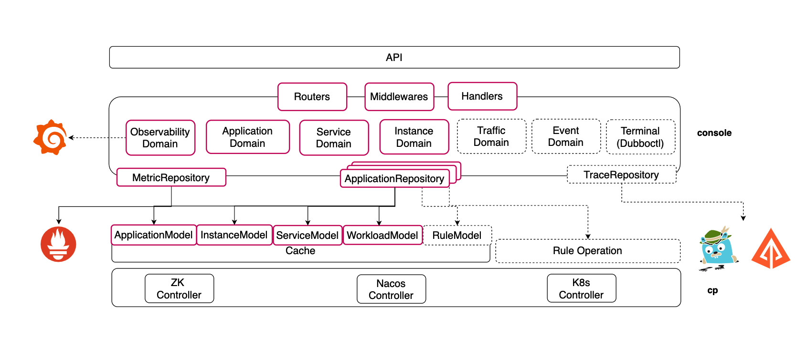

系统大致分为四层：

1. API 层：向前端和用户提供通用 API 功能；

2. 服务层：构建如 Observability/Application/Service/Instance/Traffic/Event等维度的领域对象；向 API 层提供不同维度的数据；

3. 数据处理层：抽象资源对象，统一操作协议；

4. 数据源层：包括传统的注册中心如 zk、nacos 的集群架构和基于 k8s 的云原生架构。

### 功能架构

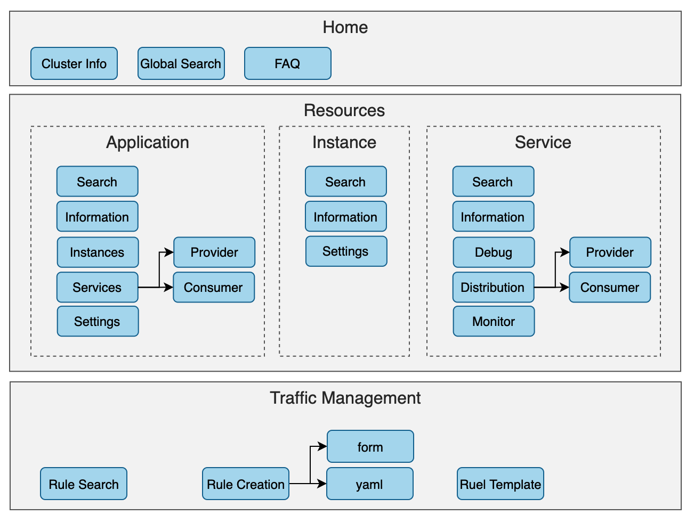

用户界面的功能大致分为三块：首页大盘、资源详情和流量管控

1. 首页大盘：包括集群一览的大盘信息，全局搜索和FAQ；

2. 资源详情：包括以 Application、Instance 和 Service 三个不同维度的资源监控和配置信息；

3. 流量管控：包括流量规则的查询和规则可视化编辑、预览、下发等功能。

### 后端框架设计

为了适配 CLASSIC CLUSTER、ALL IN K8S、MIX 三种集群模式的数据获取与操作，我们抽象出一个统一执行框架, 统一查询包括 Get 和 List 接口，统一事务操作包括：Create、Update、Delete、DeleteAll。

```Go
type ReadOnlyResourceManager interface {
	Get(context.Context, model.Resource, ...store.GetOptionsFunc) error
	List(context.Context, model.ResourceList, ...store.ListOptionsFunc) error
}

type ResourceManager interface {
	ReadOnlyResourceManager
	Create(context.Context, model.Resource, ...store.CreateOptionsFunc) error
	Update(context.Context, model.Resource, ...store.UpdateOptionsFunc) error
	Delete(context.Context, model.Resource, ...store.DeleteOptionsFunc) error
	DeleteAll(context.Context, model.ResourceList, ...store.DeleteAllOptionsFunc) error
}
```

特别指出Dataplane、Matadata 和 Mapping 的查询需要指定资源名称，资源命名约定：

1. Dataplane Name: 在 MIX 模式下为 {application}_{revision}, 在 ALL IN K8S 模式下为 pod name；

2. Matedata Name: {application}_{revision}

3. Mapping Name: 假设某个接口定义为：org.apache.dubbo.springboot.demo.DemoService1，则资源名称为org-apache-dubbo-springboot-demo-DemoService1

```Go
// metadata使⽤
func GenerateMetadataResourceKey(app string, revision string, namespace st
ring) string {
  res := app
  if revision != "" {
    res += firstDelimiter + revision
  }
  if namespace != "" {
    res += secondDelimiter + revision
  }
  return res
}
// dataplane使⽤
func GenerateNamespacedName(name string, namespace string) string {
  if namespace == "" { // it's cluster scoped object
    return name
  }
  return util_k8s.K8sNamespacedNameToCoreName(name, namespace)
}
// mapping使⽤
func GenerateMappingResourceKey(interfaceName string, namespace string) st
ring {
  res := strings.ToLower(strings.ReplaceAll(interfaceName, ".", "-"))
  if namespace == "" {
    return res
  }
  return util_k8s.K8sNamespacedNameToCoreName(res, namespace)
}

```


